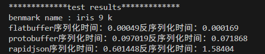

# EggplantsBuffer
## 简介
    本项目对比了flatbuffer protobuffer rapidjason序列化和反序列化的时间，以及这些序列化软件的基本用法
## 对比试验
### 实验一
    实验一采用了莺尾花（iris）数据集from kaggle
```
flatbuffer序列化时间(ms):0.220077反序列化时间(ms):0.002744
protobuffer序列化时间(ms):0.128626反序列化时间(ms):0.07008
rapidjson序列化时间(ms):0.544941反序列化时间(ms):0.704705
```

### 实验二
    实验二采用了Stanford Question Answering Dataset
```
flatbuffer序列化时间(ms):327.334反序列化时间(ms):0.001199
protobuffer序列化时间(ms):140.01反序列化时间(ms):0.113131
rapidjson序列化时间(ms):824.105反序列化时间(ms):915.07
```
## 结论
错了？
